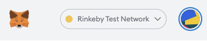

# Rinkeby Metamask Settings

1. Head over to the OMGX Web Wallet [here](https://webwallet.rinkeby.omgx.network/)
2. Connect your Metamask to the Rinkeby Testnet
   * For work on Rinkeby L1, chose _MetaMask&gt;Networks&gt;Rinkeby Test Network._

3. Add the OMGX L2 provider to your Metamask networks via this button

4. Connect your Metamask wallet to the OMGX L1 Rinkeby testnet

5. Choose between fast & slow on-ramp. 


Take note, fast on/off-ramps cost a 3% fee as you are taking part in the on/off-ramp liquidity pool. In addition there is no native ETH on OMGX, therefore you'll see 'oETH'.


6. Select your desired ETH amount and click deposit

7. Confirm the transaction in Metamask

8. Congrats! You now have funds on OMGX L2. ****You can now transact on OMGX L2. When you want to return to L1 you can either use the fast or slow exit. 


For work on Rinkeby L1, chose _MetaMask&gt;Networks&gt;Rinkeby Test Network_.

For work on the OMGX Rinkeby L2, chose _MetaMask&gt;Networks&gt;Custom RPC_ and enter `https://rinkeby.omgx.network` with a ChainID of 28.

You can seamlessly switch between the two chains.


#### How to manually add the OMGX L2 Provider

* For work on the OMGX Rinkeby L2, chose **MetaMask&gt;Networks&gt;Custom RPC** and enter `https://rinkeby.omgx.network` with a ChainID of 28.

Hit save and wait a few seconds.

